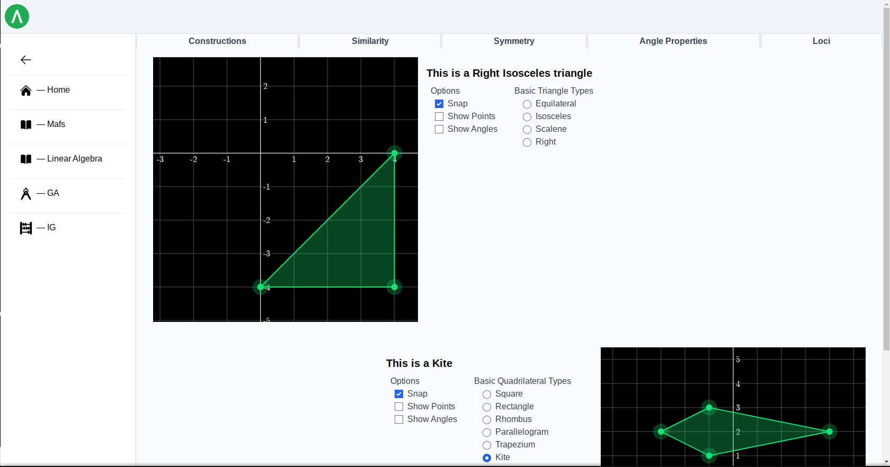
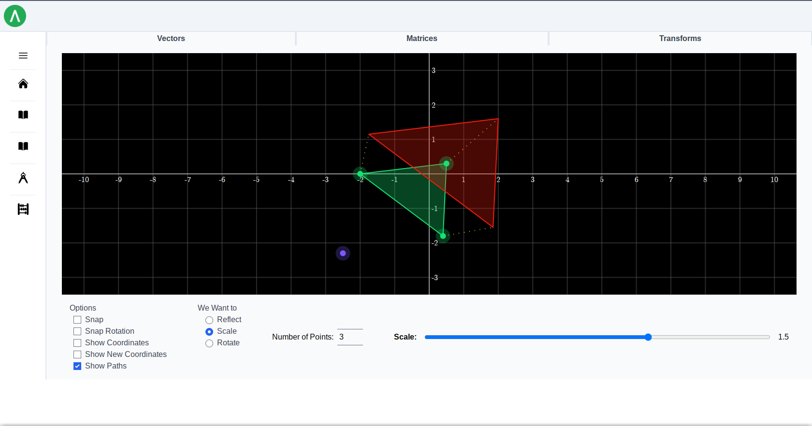
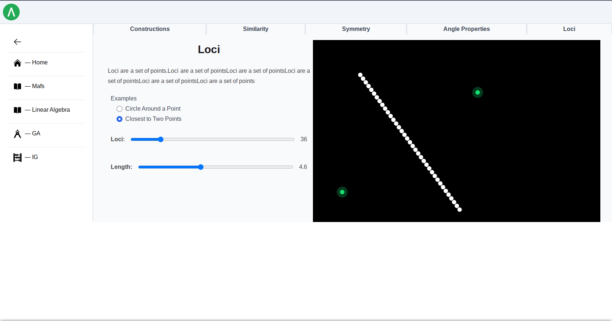
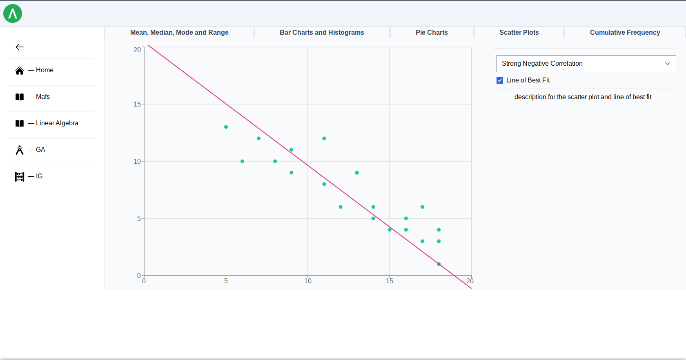
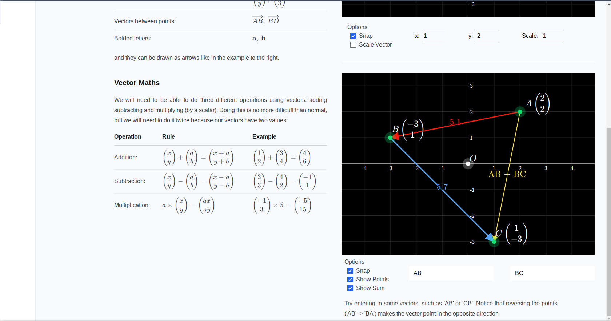
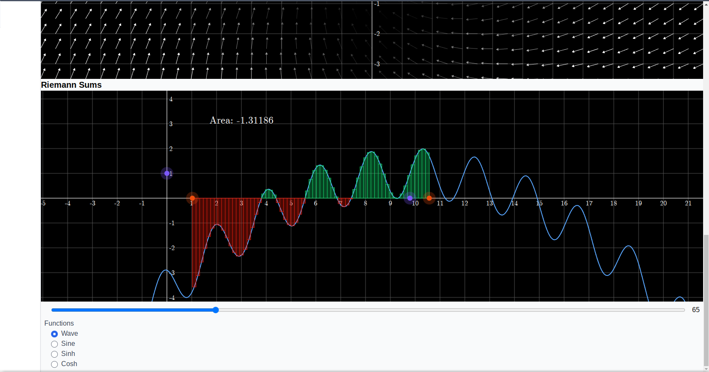
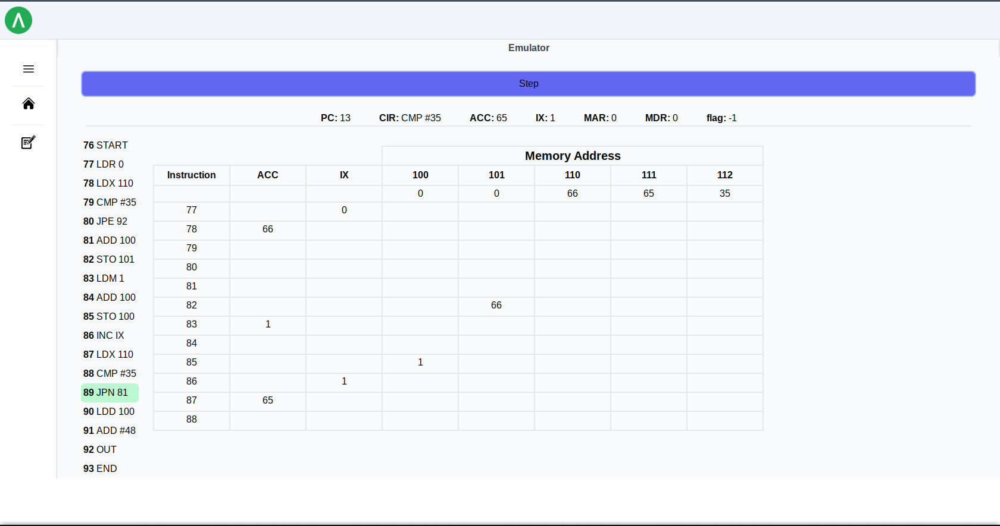

Website for testing/experimenting with interactive educational tools. Most content is currently based on IGCSE maths, physics and computer science with interactive visualizations that can be adjusted for vectors, graphs, etc. There are many small maths examples and an emulator for the AS/A assembly language that tries to match an interface with the exam papers.

Written as in a server/client structure using ASP.Net Core (via Falco) for the server and JS/React frontend (via Fable & Feliz). Maths visualizations are done via JS libaries Mafs and Recharts.

|  |   |
:-:|:-:
| Constructions  | Transforms 
| Loci  | Scatter Plots 
| Vectors  | Riemann Sums 
| Emulator 
